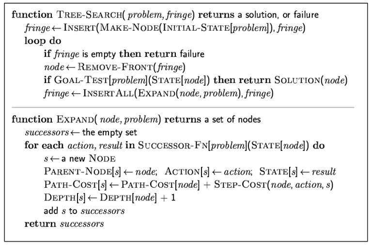
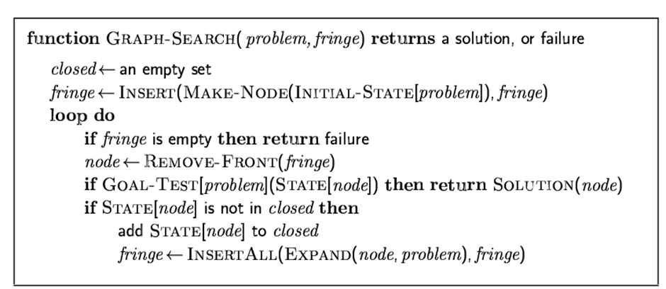
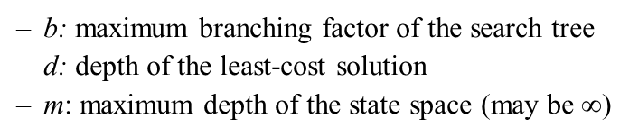
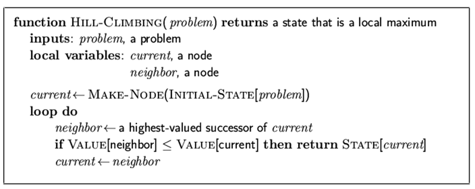
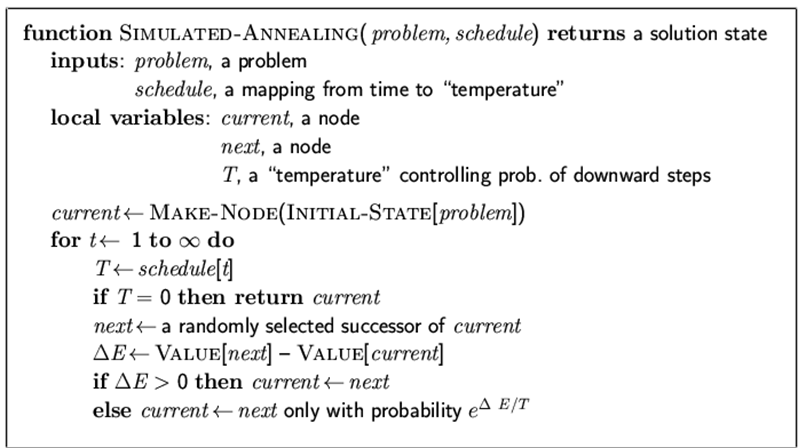
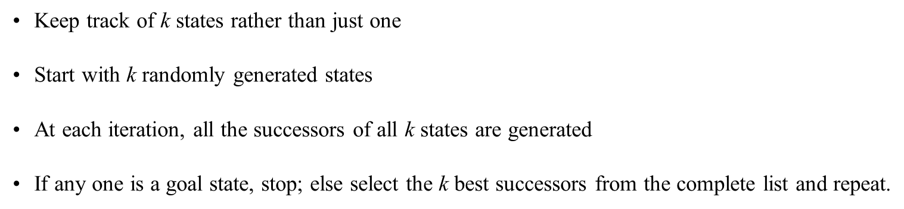

In this article I will share with you some classic search algorithms in artificial intelligence, as well as an object-oriented code structure in Python that covers all of these algorithms. 

Although search algorithms are numerous, we can always find common principles in them. So let's start with the TREE-SEARCH and GRAPH-SEARCH principals that most search algorithms follow.





For various algorithms, we define some common evaluation metrics as follows.



In both tree-search and graph search principles, we have a search problem, defined by initial state, action function, final goal, and step cost. Also, we have a search algorithm comprised of a search procedure for each step, and an expand function after each step. Thus, we summarize the basic elements in a search algorithm and define the code structure as follows.

```c++
# encoding: utf-8
# file: search_algorithm.py
# author: shawn233
# start date: 2018-09-27

from __future__ import print_function

class Problem:

    def __init__ (self):
        pass
    
    def initialState (self):
        pass
```

First we will learn several types of uninformed search, where we suppose we know no information other than the tree or graph. This is the simplest searching scenario. Uninformed search algorithms solve such problems with different strategies and costs. Such algorithms include

- Breadth-first search
- Uniform-cost search
- Depth-first search
- Depth-limited search
- Iterative-deepening search

The first three search algorithms are very similar. They only vary in their strategies to select a node to expand after each step. If you are confused about why we expand a node after each step, please refer to the tree-search and graph-search principles at the start of this article.

The latter two algorithms are updates of the depth-first search.

### Breadth-First Search

Breadth-first search, as its name states, prefers to search a full layer before moving to the next layer. To achieve this, after every step a node is tested, the algorithm selects the node which is not expanded and closest to the initial node. For this node, we can simply call it the shallowest unexpanded node. 

* Strategy: Expand shallowest unexpanded node
* Advantage: find the path of minimal length to the goal
* Disadvantage: require the generation and storage of a tree whose size is exponential the depth of the shallowest goal node
* Evaluation:
  * Completeness: Yes if b is finite
  * Time complexity: O(b<sup>d+1</sup>)
  * Space complexity: O(b<sup>d+1</sup>)
  * Optimality: Yes if step cost is a constant
* Implementation: Use FIFO queue

```c++
class SearchAlforithm:

    # ...
    
    def breadthFirstSearch (self):
        q = queue.Queue()
        q.put (self.problem.initialState())
        while True:
            if q.empty():
                print ("[warning] no solution.")
                return
            state = q.get()
            if self.problem.goalTest(state):
                print ("Solution found!")
                return state
            successors = self.problem.action (state)
            for sc in successors:
                q.put (sc)
```

### Depth-First Search

We can also learn the features of depth-first search from its name. This algorithm prefers to get to deeper layers in the search. Therefore, after each step, it expands the node which is not expanded and farthest from the initial node.

* Strategy: Expand the deepest unexpanded node.
* Evaluation:
  * Completeness: No if space with depth of infinity occurs
  * Time complexity: O(b<sup>m</sup>). Recall m is the maximum depth of the state space
  * Depth complexity: O(bm)
  * Optimality: No
* Implementation: Use LIFO queue

```c++
class SearchAlgorithm:

    # ...
    
    def depthFirstSearch (self):
        q = queue.LifoQueue()
        q.put (self.problem.initialState())
        while True:
            if q.empty():
                print ("[warning] no solution.")
                return
            state = q.get()
            if self.problem.goalTest(state):
                print ("Solution found!")
                return state
            successors = self.problem.action (state)
            for sc in successors:
                q.put (sc)
```

### Uniform-Cost Search

The uniform-cost search does not care about the breadth or the depth of the search, it only cares about the step cost to expand the node. Actually, searching ordered by the step cost does not benefit any better than breadth-first or depth-first strategy. Any of the first three algorithms just tries nodes in the tree or graph, hoping to get lucky and find the goal. This is not hard to understand. All of these three algorithms (breadth-first, depth-first, uniform-cost) know nothing about the goal more than the goal is in the tree/graph. 

* Strategy: expand the least-cost unexpanded node
* Evaluation:
  * Completeness: Yes if step cost is greater than ε
  * Time complexity: number of nodes with cost less than the cost of optimal solution, i.e. O(b<sup>ceiling(C\*/ε)</sup>), where C\* is the cost of the optimal solution
  * Space complexity: number of nodes with cost less than C\*, i.e. O(b<sup>ceiling(C\*/ε)</sup>)
  * Optimality: Yes for nodes expand in ascending order of cost.
* Implementation key idea: make `fringe` a priority queue, ordered by the path cost
* Implementation

```c++
class ComparableNode:
    '''
    Encapsulate nodes in this class to support a priority queue
    '''

    def __init__ (self, node, measure):
        self.node = node
        self.measure = measure
    
    def __cmp__ (self, other):
        if self.measure < other.measure:
            return True
        else:
            return False
    
    def getNode (self):
        return self.node
    
    def getMeasure (self):
        return self.measure

class SearchAlgorithm:

    # ...
    
    def uniformCostSearch (self):
        q = queue.PriorityQueue()
        q.put (ComparableNode(self.problem.initialState(), 0))
        current_cost = 0
        while True:
            if q.empty():
                print ("[warning] no solution.")
                return
            comparable_node = q.get() # of type ComparableNode
            state = comparable_node.getNode()
            current_cost = comparable_node.getMeasure()
            if self.problem.goalTest (state):
                print ("Solution found!")
                return state
            successors = self.problem.action (state)
            for sc in successors:
                cost = current_cost + self.problem.stepCost (state, sc)
                q.put (ComparableNode(sc, cost))
```

### Depth-Limited Search

The depth-first search algorithm fails when infinite depth exists in the state space. So the depth-limited search is proposed to fix this. In this algorithm, a limit for the search depth is manually set in order to prevent the search from diving too deep into a branch whose depth may be infinite.

* Strategy: Set a depth limit l for the depth-first search algorithm
* Evaluation:
  * Completeness: No
  * Time complexity: number of nodes visited within the limited depth d. N<sub>DLS</sub> = b<sup>0</sup> + b<sup>1</sup> + ... + b<sup>d</sup> = O(b<sup>d</sup>)
  * Space complexity: O(bd)
  * Optimality: No from DFS
* Implementation: There are two major ways of implementation, recursive or non-recursive. Considering the poor performance in function calls of Python, I present a non-recursive implementation.

```c++
class SearchAlgorithm:

    # ...
    
    def depthLimitedSearch (self, l):
        '''
        Argument l indicates the depth limit
        '''
        q = queue.LifoQueue()
        depth_q = queue.LifoQueue()
        q.put (self.problem.initialState())
        depth_q.put (0)
        visit_cnt_q.put (0)
        while True:
            if q.empty ():
                print ("[warning] no solution.")
                return
            state = q.get()
            if self.problem.goalTest(state):
                print ("Solution found!")
                return state
            depth = depth_q.get()
            if depth == l:
                continue
            successors = self.problem.action (state)
            for sc in successors:
                q.put (sc)
                depth_q.put (depth + 1)
```

### Iterative Deepening Search

The iterative deepening search divides the search into many depths. In each depth, the algorithm invokes a limited-depth search. This algorithm can be considered as a combination of both breadth-first search and depth-first search. It integrates the advantages of both algorithms. The following figure demonstrates this process.


* Strategy: Iteratively search by depth-limited algorithm with depth limit increased
* Advantage:
  * Linear memory requirements acquired from depth-limited search
  * Guarantee for goal node of minimal depth
* Evaluation:
  * Completeness: Yes
  * Time /Space complexity: N<sub>IDS</sub> = (d+1)b<sup>0</sup> + db<sup>1</sup> + ... + 2b<sup>d-1</sup> + b<sup>d</sup> = O(b<sup>d</sup>)
  * Space complexity: O(bd)
  * Optimality: Yes if step cost is a constant

```c++
class SearchAlgorithm:

    # ...
    
    def iterativeDeepeningSearch (self, max_depth = 1e5):
        for depth in range (max_depth):
            res = self.depthLimitedSearch(depth)
            if res:
                return res
        print ("[warning] iterative deepening search can not find a solution in depth range: <", max_depth)
```

After five uninformed algorithms are introduced. Now we come to the topic of informed search. We will see that with additional information, the search algorithm changes significantly.

### Best-First Search

A typical informed search algorithm is the best-first search algorithm. It introduces an **evaluation function**  f(n) to estimate our desire to expand each node. In each step, we should always **expand the most desirable unexpanded node**. A natural implementation is to store nodes in a priority queue sorted by the value of evaluation.

A best-first search is determined by the evaluation function, so in this part, I will define the evaluation function as an interface, and write a template of the best-first search. Later we will introduce two special cases in the best-first search, namely, the greedy best-first search and the A\* search. We will implement them imitating this template.

```c++
class SearchAlgorithm:

    # ...
    
    def bestFirstSearch (self, evaluation):
        '''
        Only a template, can not run
        '''
        q = queue.PriorityQueue()
        q.put (ComparableNode(self.problem.initialState(), 0))
        while True:
            if q.empty():
                print ("[warning] no solution.")
                return
            comparable_node = q.get()
            state = comparable_node.getNode()
            if self.problem.goalTest(state):
                print ("Solution found!")
                return state
            successors = self.problem.action (state)
            for sc in successors:
                q.put (ComparableNode(sc, evaluation(sc)))
```

### Best-First Search I - Greedy Best-First Search

Introduce another function: **heuristic function** h(n). This function returns an estimated cost from n to the goal. In this algorithm, we use heuristic function as evaluation function, i.e. f(n) = h(n)

In short, the strategy is to expand the node that appears to be the closest to the goal.

* Evaluation:
  * Completeness: No because the search may get stuck in some loop
  * Time complexity: O(b<sup>m</sup>)
  * Space complexity: O(b<sup>m</sup>) for all nodes are stored
  * Optimality: No
  

The implementation is actually based on the best-first search template defined above.

```c++
class SearchAlgorithm:

    # ...
    
    def greedyBestFirstSearch(self, heuristic):
        return self.bestFirstSearch(heuristic)
```

### Best-First Search II - A\* Search

The key idea of updating greedy bf search to A\* search is to modify the evaluation function f(n) from h(n) to g(n) + h(n), where g(n) is the path cost from initial state to n. 

So in short the strategy is to avoid expanding nodes that are expensive.

* Evaluation:
  * Completeness: Yes
  * Time complexity: Exponential
  * Space complexity: All nodes are stored in memory
  * Optimality: Yes

```c++
class AStarNode (ComparableNode):

    def __init__ (self, node, measure, path_cost):
        ComparableNode.__init__(node, measure)
        self.path_cost = path_cost
    
    def getPathCost (self):
        return self.path_cost

class SearchAlgorithm:

    # ...
    
    def aStarSearch (self, heuristic):
        q = queue.PriorityQueue()
        q.put (AStarNode(self.problem.initialState(), 0, 0))
        while True:
            if q.empty ():
                print ("[warning] no solution.")
                return
            a_star_node = q.get()
            state = a_star_node.getNode()
            if self.problem.goalTest (state):
                print ("Solution found!")
                return state
            path_cost = a_star_node.getPathCost()
            successors = self.problem.action (state)
            for sc in successors:
                pc = path_cost + self.problem.stepCost(state, sc)
                measure = heuristic(sc) + pc
                q.put (AStarNode(sc, measure, pc))
```

Other than uninformed and informed search algorithms which iterate the searching space, another category of search algorithms performs better in scenarios where the search space is extremely large, or when no exact goal-test function is specified. The property of this kind of search algorithms is that, they always find a local optimum, but only hope it is the global optimum.

This type of algorithms is called local search algorithms.

### Hill-Climbing Search

The name of this algorithm means we should iteratively update the current state towards the optimal state.

The implementation varies across particular cases. Here I only provide an algorithm description.



The disadvantage of this algorithm is obvious: the search always gets stuck in some local extremes.

### Simulated Annealing Search

This algorithm updates the hill-climbing algorithm, solving the problem of local extremes using some probabilistic method.

The key idea is to allow some bad moves in the hill-climbing search, but only allow it in a decreasing probability.

The algorithm description is as follows.



### Local Beam Search

This algorithm is essentially running several hill-climbing searches simultaneously. It also aims at solving the problem of local extremes.



### Genetic Algorithm

This is big topic. Google it!


