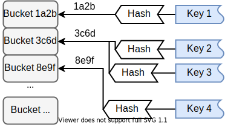
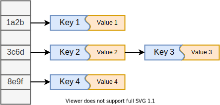

# std::unordered_map

Official docs: [link](http://www.cplusplus.com/reference/unordered_map/unordered_map/)

unordered_map is basically a hash table, comprised of keys and their mapped values. (key, value) pairs are organized into **buckets** depending on the **hash values** of keys to allow for quick access to elements.

The following figure shows a possible mapping relations in an unordered_map object.



With respect to the relations in the above figure, the unordered_map object should be stored in the memory as:



Then values can be accessed in an efficient way via hashing their keys.

For example, to access `value 3`, first calculate `hash(key 3)`, which yields `3c6d`. Then through the linked list stored in `bucket[3c6d]`, find a pair whose key field is exactly `key 3`, and its value field should be `value 3`.

**Remark** that values in an unordered_map object can only be accessed via their keys and can not be accessed by their absolute position in the container. 

## Template Parameters

```c++
template < class Key,                                    // unordered_map::key_type
           class T,                                      // unordered_map::mapped_type
           class Hash = hash<Key>,                       // unordered_map::hasher
           class Pred = equal_to<Key>,                   // unordered_map::key_equal
           class Alloc = allocator< pair<const Key,T> >  // unordered_map::allocator_type
           > class unordered_map;
```

| Paramter | Explanation                                                  | Default Value                      |
| -------- | ------------------------------------------------------------ | ---------------------------------- |
| Key      | key type                                                     | /                                  |
| T        | mapped type                                                  | /                                  |
| Hash     | a unary hash function object. Take either a [function object (functor)](https://en.wikipedia.org/wiki/Function_object) or a function pointer, which takes a `key_type` object and returns a unique `size_t` value. | hash\<Key\>                        |
| Pred     | a binary predicate that takes two `key_type` objects and returns `true` if two keys are considered equivalent. | equal_to\<Key\>                    |
| Alloc    | allocator type that defines the storage allocation model.    | allocator\< pair\<const Key,T\> \> |

**Note** that `mapped_type` is not `value_type` since value_type is defined as

```c++
typedef pair<const Key, T> value_type;
```

This `value_type` is intended for iterators, which are pointers to `value_type` elements.

```c++
unoredered_map<Key,T>::iterator it;

(*it).first;
it->first;			// key_type

(*it).second;
it->second;			// mapped_type

(*it);				// value_type
```

## Initialization

### Empty

get an empty unordered_map object

```c++
// declaration
unordered_map();
// example
unordered_map<string,string> first;
```

### Initializer list

initialize the container with the contents of the list

```c++
// declaration
unordered_map(initializer_list<value_type> il);
// example
unordered_map<string,string> second({ {"apple","red"},
                                     {"lemon","yellow"} });
unordered_map<string,string> third ({ {"orange","orange"},
                                     {"strawberry","red"} });
```

### Copy

copy the contents of an existing unordered_map object `ump`

```c++
// declaration
unoredered_map(const unordered_map& ump);
// example
unordered_map<string,string> fourth(second);
```

### Move

acquire the contents of the rvalue `ump`

```c++
// declaration
unordered_map(unordered_map&& ump);
// example
unordered_map<string,string> fifth(merget(second,third));
```

## Member Functions

```c++
unordered_map<string, string> mymap;
```

### Insert elements

Two methods are provided to insert elements. *emplace()* constructs and inserts one new element. *insert()* inserts one or multiple new elements by copying existing value_type objects, moving rvalue, or constructing from an initializer list.

**Remark** that a new element can only be inserted when its key is unique.

*emplace()*:

```c++
// decalaration
template <class... Args>
pair<iterator, bool> emplace ( Args&&... args );

// examples
mymap.emplace("apple", "red");
mymap.emplace("lemon", "yellow");
```

*insert()*:

```c++
// declaration
pair<iterator,bool> insert ( const value_type& val );
template <class P>
    pair<iterator,bool> insert ( P&& val );
template <class InputIterator>
    void insert ( InputIterator first, InputIterator last );
void insert ( initializer_list<value_type> il );

// examples
pair<string, string> myfavorite("banana", "yellow");
unordered_map<string,string> summer(
    { {"watermellon", "green"},{"pineapple", "orange"} });

mymap.insert(myfavorite); // copy
mymap.insert(make_pair<string,string>("strawberry", "red")); // move
mymap.insert(summer.begin(), summer.end()); // range
mymap.insert({ {"grape", "purple"},
              {"pomegranate", "red"} }); // initializer list
```

### Access elements

Two methods are provided to access elements. *operator []* and *at()* both access the element based on the given key, and return the reference to its mapped value. However, when the given key does not match any key in the unordered_map object, *operator []* also inserts a new element using this key.

*operator []*:

```c++
// declaration
mapped_type& operator[] ( const key_type& k );
mapped_type& operator[] ( key_type&& k );

// examples
string color = mymap["lemon"]; // read
mymap["apple"] = "green"; // write
mymap["cherry"] = "red"; // insert
```

*at()*:

```c++
// declaraction
mapped_type& at ( const key_type& k );
const mapped_type& at ( const key_type& k ) const;

// examples
string color = mymap.at("lemon"); // read
mymap["apple"] = "green"; // write
```

### Check key existence

Use method *find()*. If the given key is found, method returns an iterator to it, otherwise returns unordered_map::end.

```c++
// declaration
iterator find ( const key_type& k );
const_iterator find ( const key_type& k ) const;

// examples
if (mymap.find("cantaloupe") == mymap.end())
    cout << "key not found" << endl;
```

